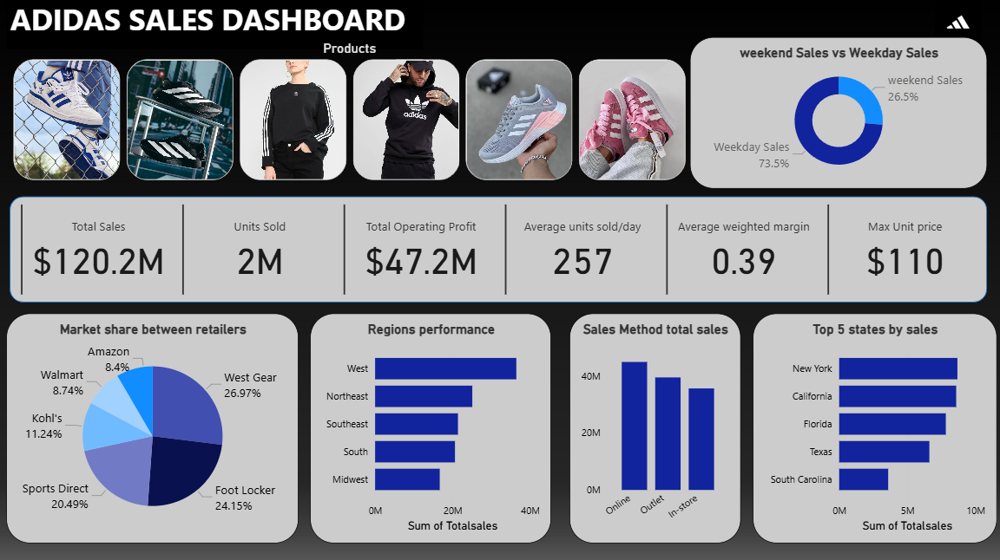
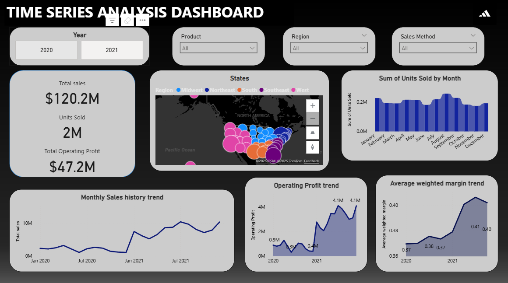

# Adidas-Sales-Analytics
Adidas Sales Analysis is a Power BI and Excel project that explores retail performance across regions, products, and retailers. After preparing the dataset in Excel, interactive dashboards in Power BI were built to track total sales, profit margins, and units sold, providing insights into overall business performance.

## 📸 Screenshots

